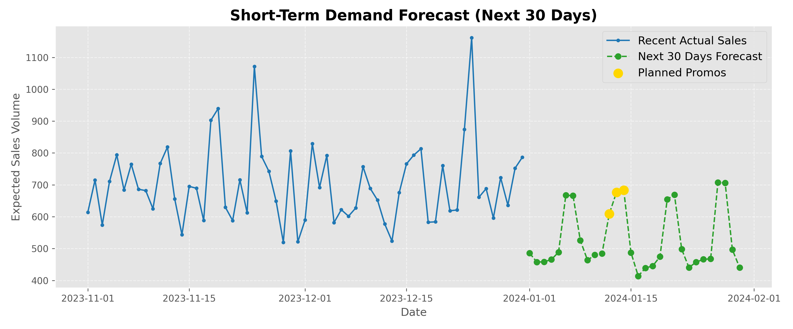
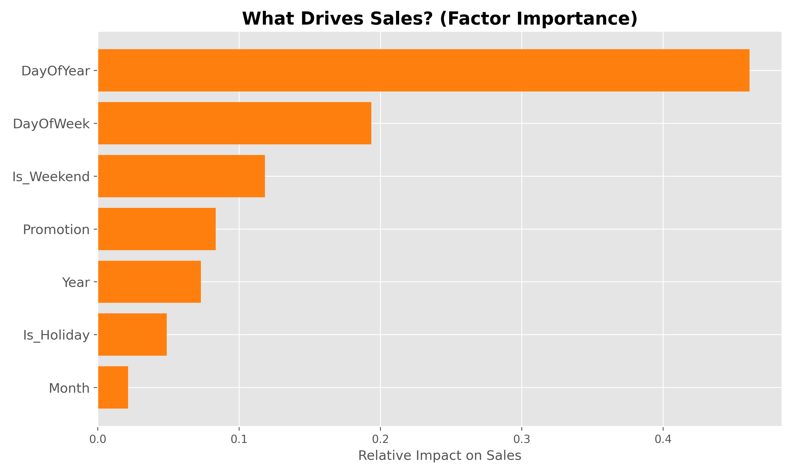

# 📈 Retail Sales & Demand Forecasting

https://salesforecastingappstudent.streamlit.app/

**A Machine Learning pipeline that uses historical business data to predict the next 30 days of retail sales volume, designed to prevent inventory stockouts and optimize staff scheduling.**

## 🎯 The Business Problem
One of the biggest money leaks for retail businesses is poor demand forecasting. Over-ordering leads to dead stock eating up cash flow, while under-ordering during a promotion causes stockouts and lost revenue.

## 💡 The Solution
This project is an end-to-end Machine Learning pipeline that solves exactly this problem. I built a **Sales & Demand Forecasting Model** that ingests years of historical business data to predict exactly how many actual units will sell over a 30-day continuous outlook.

By factoring in variables like weekly seasonality, major holidays, and planned promotional events, business managers can transition from *reactive* guessing to a *proactive* data-driven strategy.

## 📊 Key Features & Visual Insights
* **Interactive Dashboard:** Deployed a fully interactive Streamlit frontend for non-technical stakeholders to explore the data dynamically.
* **Feature Engineering:** Extracted temporal signals (Day of Week, Monthly Seasonality, Holidays) from raw dates to map out human buying behavior.
* **Random Forest Regressor:** Trained an ensemble model to capture non-linear trends and isolate specific promotional anomalies.

*(Here is a preview of the Short-Term Forecast interface)*  

*(Discovering the specific drivers of sales via Feature Importance)*  

## 💼 Business Impact & Actionable Steps
Based on the forecast output, a business can immediately deploy three strategies:
1. **📦 Inventory Optimization:** Order stock 2-3 weeks in advance of projected mid-month peaks to prevent stockouts while protecting cash flow on slow weeks.
2. **🧑‍🤝‍🧑 Staffing Planning:** Schedule 20-30% more staff on predicted high-volume weekends and reduce staffing safely on mid-week troughs.
3. **💸 Cash Flow Forecasting:** Leverage the anticipated revenue volume projected over the next month for budgeting ad spend.

## 🛠️ Technology Stack
* **Python** 
* **Pandas & NumPy** (Data processing, simulation, and feature engineering)
* **Scikit-Learn** (Random Forest Modeling & Evaluation)
* **Matplotlib** (Data Visualization)
* **Streamlit** (Web Application Deployment)

---
### To Run Locally
1. Clone this repository
2. Install dependencies: `pip install -r requirements.txt`
3. Run the dashboard: `streamlit run app.py`
